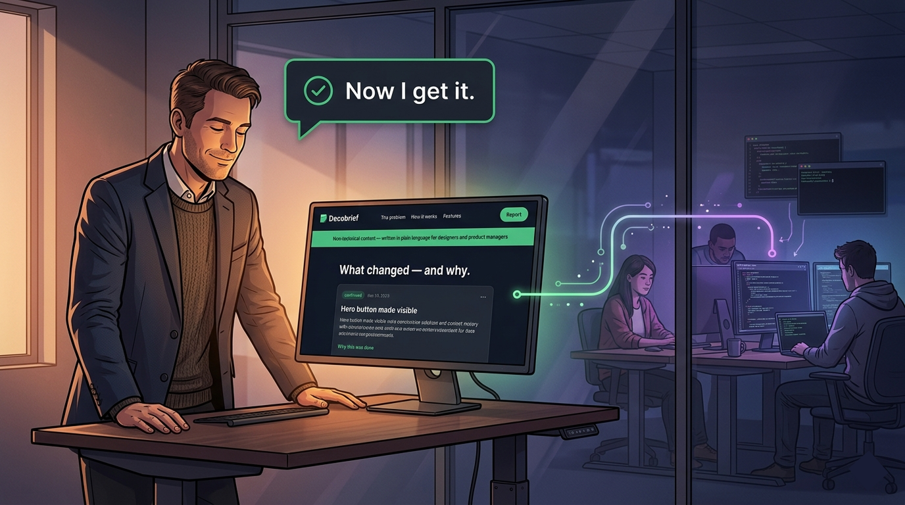
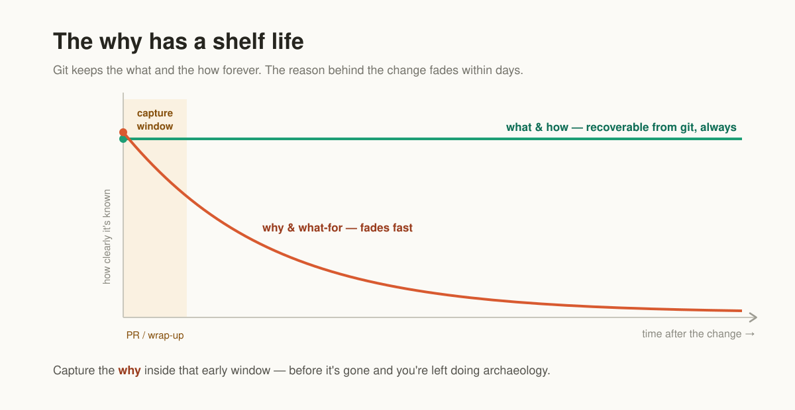
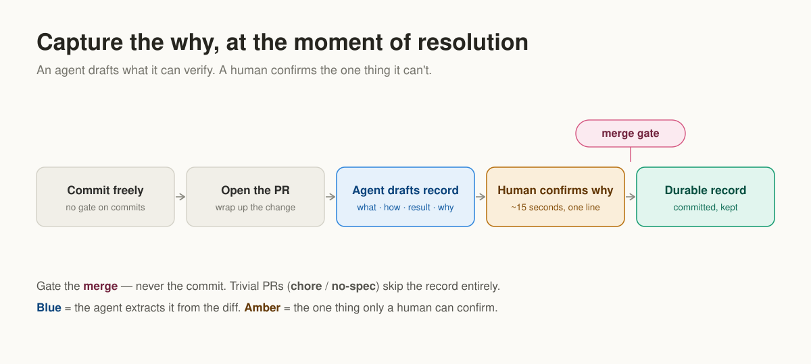
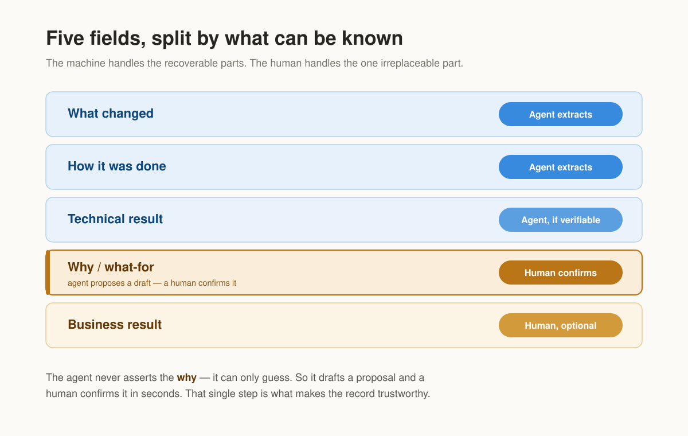
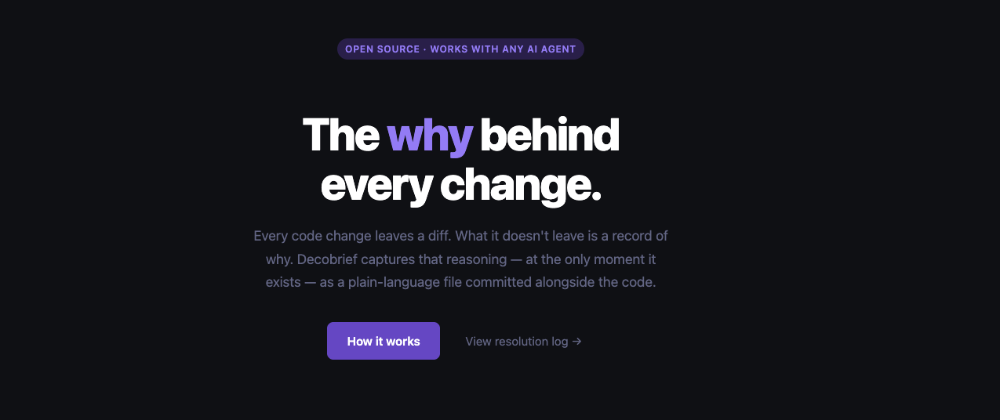
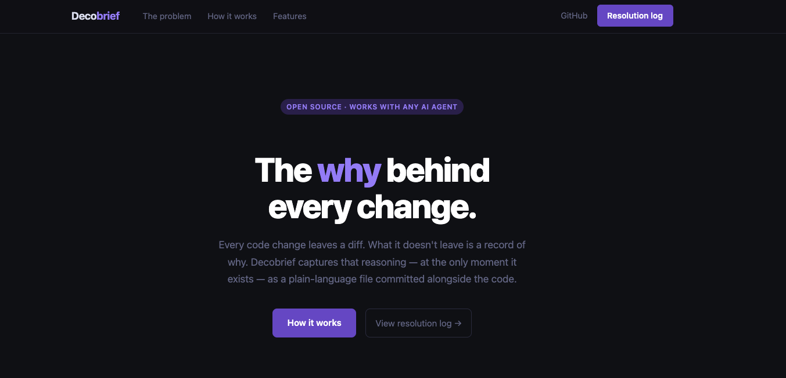
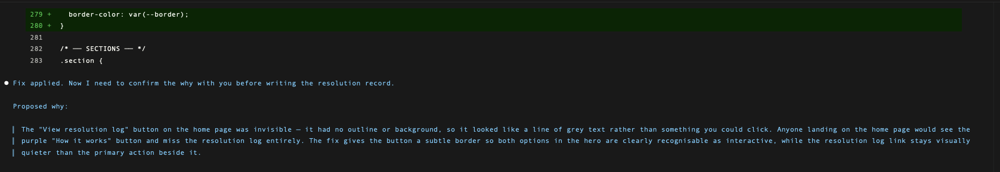
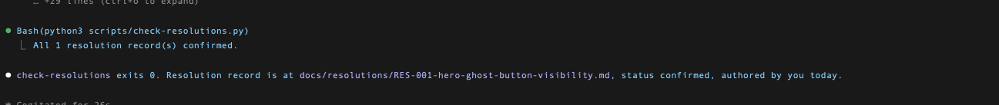

# Decobrief

> Decode every technical decision into plain language — for everyone who wasn't in the room.



---

## The problem

Every code change produces artefacts: a diff, a commit, maybe a ticket. What it does not produce is a record of *why*. That reasoning lives only in the developer's head — and it starts fading the moment they move on to the next task.

Six months later, when someone asks "why did we do this?" or "can we safely change it?", the answer requires tracking down the original author, re-reading an ambiguous ticket, or just guessing. The cost compounds: decisions get re-litigated, bugs get re-introduced, onboarding takes weeks instead of days.

### Why knowledge decays faster than code



*What* a change does is preserved in the diff forever. *Why* it was made is only fully known at the moment of the change — and decays rapidly from there. Waiting even one sprint to capture it means capturing a pale copy.

---

## The solution

A **resolution record** is one markdown file committed alongside the code. It captures what changed, how, the technical result, the *why*, and (optionally) the business outcome.

The key insight: an AI agent can verify the first three fields directly from the diff. It cannot know the *why* — that lives in the developer's head. So the agent proposes a why and asks the human to confirm or correct it in one sentence. That confirmation, made while the reasoning is still fresh, is the single most valuable step.

### The full workflow



1. Developer finishes a change and says "write the resolution record."
2. Agent reads the diff, drafts what changed / how / technical result.
3. Agent proposes the *why* in plain language and asks for confirmation.
4. Developer confirms or corrects in one sentence.
5. Record is committed. Status set to `confirmed`.

The entire process adds less than 90 seconds to any change.

### What the agent can know vs. what only the human can



| Field | Who fills it | Source | Confidence |
|---|---|---|---|
| What changed | Agent | the diff / files | High — it is in the code |
| How it was done | Agent | the diff / files | High — the approach is visible |
| Technical result | Agent | tests, CI, benchmarks | Medium — state only what is verifiable |
| **Why / what-for** | **Agent proposes → human confirms** | ticket + branch + inference | Low until confirmed |
| Business result | Human | the work item's success criterion | The agent cannot know this |

The record is only as trustworthy as this split is respected. The agent must never present an unconfirmed *why* as fact.

---

## The fix spec

Before writing any code, engineers often write a short **fix spec**: a plain description of what "done" looks like — acceptance criteria, constraints, which areas to look at — without prescribing the implementation.

The spec sits between the bug ticket and the actual code change. It is not part of the Decobrief workflow (which starts after the change is made), but it feeds directly into it: when the agent reads the spec alongside the diff, it has richer context for proposing the *why* and the technical approach.

A good fix spec answers:
- What does the user experience look like when this is fixed?
- What are the acceptance criteria?
- What should not change?

A good fix spec does **not** contain:
- The implementation (which CSS property to add, which function to call)
- The solution approach — that is the agent's job to discover from the code

This separation is what keeps the Decobrief record honest. If the spec already contains the answer, the agent is executing instructions, not reasoning about the problem. The resolution record captures *why a decision was made*, and that only has value if the decision was actually made — not handed over pre-written.

---

## Agent instructions

These instructions are tool-agnostic. Attach this file to any AI coding agent, or paste the section below into a system prompt or rules file.

### How to attach this file

| Tool | How |
|---|---|
| **Claude Code** | `claude --add-file README.md` or reference it in the chat |
| **Cursor** | Add to `.cursorrules`, or `@`-mention it when wrapping up a change |
| **GitHub Copilot** | Paste the "Instructions for the agent" section into `.github/copilot-instructions.md` |
| **Windsurf / Cody / others** | Add to the tool's rules/context, or attach to the chat |

The instructions are written in the second person so they work whether loaded as a rule, a system prompt, or an attached file.

---

### Instructions for the agent

When the developer finishes a change and is wrapping it up (opening a pull request, or just saying "write this up", "document why I did this", "capture this change"), produce a **resolution record**: one markdown file under `docs/resolutions/`.

#### Step 1 — Gather context, best source first

Collect what you can, in this order of reliability:

1. The diff of the change — `git diff <base>...<head>`, or the PR diff. Highest fidelity.
2. If there is no git or no diff available: the current contents of the files the developer points you at, and what changed in this session.
3. Commit messages, branch name, PR title/description.
4. The conversation itself — if the change was made with you, the reasoning may already be here.
5. A fix spec, **if one exists** — read the acceptance criteria and constraints as context for what the engineer was trying to achieve. Do not copy the spec into the record; use it to inform the *why*.
6. A linked ticket, **only if** the project uses a tracker (see "Optional: tracker input"). Never assume one exists.

#### Step 2 — Draft five fields, split by who can know them

Fill each field according to how confidently it can be known. Never let a guess masquerade as fact.

| Field | Who fills it | Source | Confidence |
|---|---|---|---|
| What changed | You (the agent) | the diff / files | high — it is in the code |
| How it was done | You | the diff / files | high — the approach is visible |
| Technical result | You | tests, CI, measured numbers | medium — state only what you can verify |
| Why / what-for | You **propose**, human **confirms** | ticket + spec + inference | low — you are guessing until confirmed |
| Business result | Human | the work item's success criterion | you cannot know this |

Honesty rules — these are what keep the record trustworthy:

- **Proportionality.** A one-line fix did not "overhaul" or "revolutionize" anything. Describe the change at its true scale. Inflated language is the most common failure here.
- **No invented results.** Only state a technical result you can verify — a test that passed, a benchmark you ran, a number in the diff. Do not assert behavior the code does not demonstrate.
- **Separate technical result from business result.** "Latency dropped 30%" is a technical result you can extract now. "Completion rate above 40% in week one" is a business outcome that resolves later — record it only as a *reference* to the work item's success criterion, never as something you measured.
- **The why is always a proposal.** Even when a ticket and spec exist, write the why as a proposal marked `needs-confirmation`. The human confirmation is the single most valuable step in the cycle. Never present an unconfirmed why as fact.
- **Plain language throughout.** Write every section — especially the why — as if explaining to someone who was not in the room when the decision was made. Avoid jargon. A future reader may not be an engineer.

#### Step 3 — Write the record

Write one file: `docs/resolutions/RES-<ref>-<slug>.md`, where `<ref>` is the work-item reference if one exists, otherwise the PR number (or a short date). Use this exact template:

```markdown
---
work_item: ""          # tracker reference (URL, PROJ-123, #482) — leave empty if none
pr: ""                 # PR number or URL, e.g. "#482" — or leave empty
status: needs-confirmation   # draft | needs-confirmation | confirmed
author: ""             # who confirmed the why (set when status -> confirmed)
date: ""               # YYYY-MM-DD
---

# <Short title of the change>

## What changed
<Concrete: which files, modules, functions. True scale, no inflation.>

## How it was done
<The actual approach: the mechanism, the key implementation decision, anything
a future reader needs to understand the diff.>

## Technical result
<Verifiable only: tests added/passing, CI status, measured perf change.
Omit if there is nothing you can verify.>

## Why / what-for   <!-- needs-confirmation until a human signs off -->
<PROPOSED by the agent. Plain language: the problem this solves and who it is
for. One or two sentences a non-technical reader can understand. A guess until
confirmed.>

## Business result   <!-- optional -->
<A REFERENCE to the work item's success criterion that resolves later.
Omit if there is no defined success metric.>
```

#### Step 4 — Ask the human to confirm the why

Show the proposed **Why / what-for** to the developer in one or two sentences and ask them to confirm or correct it. When they do, set `status: confirmed` and fill `author` and `date`. Do not offer to "write it from scratch" — your draft is the starting point so the human only has to react, which is what keeps friction low.

#### Step 5 — Keep the record

The file is committed alongside the code and **never deleted**. It is durable history — the long-term memory of *why* this change exists.

#### When to skip

A trivial change — a typo, a dependency bump, a pure chore — has no business "why" worth capturing. Skip the record for these (and if the project enforces a gate, label the PR `chore` or `no-spec`). Be conservative: when in doubt, capture.

---

### Optional: merge gate

If the team uses pull requests with required status checks, enforce that a non-trivial PR cannot merge until its record's `status` is `confirmed`. Run the checker at `scripts/check-resolutions.py`:

```bash
npm run check-resolutions   # or: bun run check-resolutions
# exits 0 if every record in docs/resolutions/ is confirmed
# exits 1 and prints the offending files if not
```

Gate the **merge** only — never the commit, never the work.

---

### Optional: tracker input

The core needs no issue tracker. If the project uses one (Jira, Linear, GitHub Issues, ClickUp, etc.):

- **Input:** if a work-item reference appears on the branch, PR, or commits, read the ticket's description and success criterion and use them as input when proposing the why and the business result.
- **Write-back:** on merge, optionally push the resolution status back to the ticket.

With no tracker, leave `work_item` empty. Nothing breaks.

---

## Try it

This repository ships with **two tasks**: one already resolved (to show the full cycle),
and one open (for you to run yourself).

| File | Purpose |
|---|---|
| `docs/task-problem.md` | Bug ticket for the **open task** — describes the problem, no solution |
| `docs/fix-spec.md` | Fix spec for the open task — acceptance criteria only |
| `docs/resolutions/` | Resolution records — one already confirmed, one to be created |
| `scripts/check-resolutions.py` | Merge-gate checker |

---

### Task 1 — Already resolved (example)

The first change this project captured: the "View resolution log →" button in the hero
was invisible — no border, no background, indistinguishable from plain text.

The agent found the missing `border` in `.btn-ghost`, applied the fix, drafted the
record, and asked for confirmation of the *why*. The confirmed record lives at
`docs/resolutions/RES-001-hero-ghost-button-visibility.md`.

**Before and after:**





**What the agent interaction looked like:**



**Merge gate passing after confirmation:**



---

### Task 2 — Open (try it yourself)

The resolution log at `/resolutions` shows record titles derived from filenames
(`RES 001 hero ghost button visibility`) instead of the human-readable title from
inside the file (`Hero "View resolution log" button made visible`). Unreadable for
anyone outside engineering.

The bug ticket is at `docs/task-problem.md`. The fix spec with acceptance criteria
is at `docs/fix-spec.md`.

Run this prompt in your AI coding agent:

```
Read the bug ticket in docs/task-problem.md and the fix spec in docs/fix-spec.md.
Find and fix the issue in the code. Then write the resolution record following
the agent instructions in README.md.
```

The agent will read the spec, look at the code, find the root cause, apply the fix,
and draft a resolution record. Confirm the *why* in one sentence, then run:

```bash
npm run check-resolutions   # should exit 0
```

---

## Commands

```bash
# npm
npm run dev               # start the site at localhost:4321
npm run build             # static build
npm run preview           # preview the static build
npm run check-resolutions # exits 0 if all resolution records are confirmed

# bun
bun dev
bun run build
bun run preview
bun run check-resolutions
```

---

## The one idea, in a sentence

Every technical change leaves a diff that engineers can read. Decobrief adds the one thing the diff cannot contain: a plain-language explanation of *why* — drafted by the agent, confirmed by the engineer in one sentence, readable by everyone.
